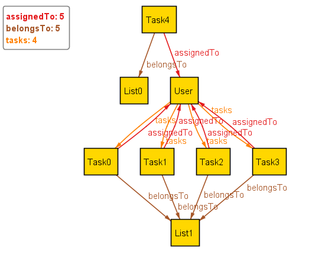
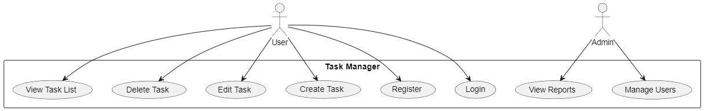
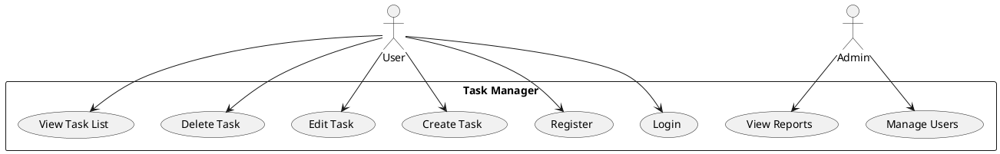
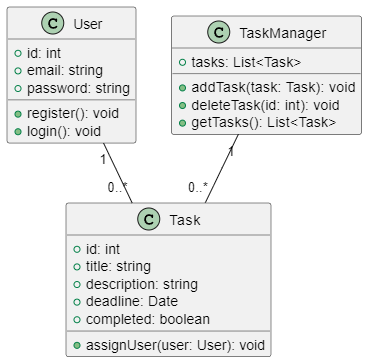
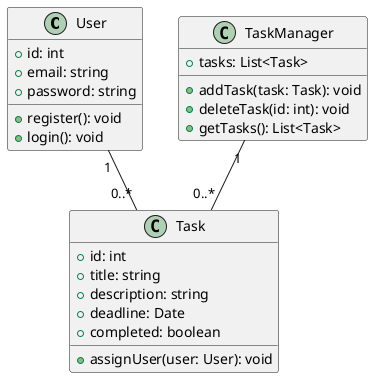
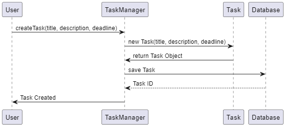
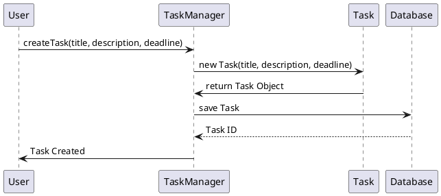

# Project1
# Модель якості веб-додатку для управління задачами  
### Відповідно до ISO/IEC 25010 та ISO/IEC 25019:2023  

## 1. Вступ  
Даний документ визначає **модель якості** веб-додатку для управління задачами, засновану на міжнародних стандартах **ISO/IEC 25010** та **ISO/IEC 25019:2023**.  
Основна мета – встановити критерії оцінки якості, визначити метрики та методи їх вимірювання.

### **Основні цілі моделі якості:**  
- Визначення **ключових характеристик якості** згідно ISO/IEC 25010.  
- Контроль **якості коду** на основі автоматизованого аналізу.  
- Забезпечення **функціональної придатності, продуктивності та безпеки** веб-додатку.  
- Використання **автоматизованих інструментів тестування та аналізу коду**.  

### **Об'єкт оцінювання:**  
- **Бекенд:** Node.js, Express, SQLite.  
- **Фронтенд:** React, Vite, TailwindCSS.  
- **База даних:** SQLite (`database.sqlite`).  
- **Автоматизація якості:** Jest, SonarQube, Lighthouse, ESLint.  

---

## 2. Характеристики якості згідно ISO/IEC 25010  
### 2.1. Функціональна придатність  
**Оцінюється коректність роботи API, виконання CRUD-операцій та відповідність вимогам.**  
**Метрики:**  
- Покриття тестами API (% тестованих ендпоінтів).  
- Кількість успішних запитів до API (%).  
- Відсутність критичних помилок у логах.  

### 2.2. Продуктивність  
**Визначається швидкість обробки запитів сервером, швидкість завантаження інтерфейсу.**  
**Метрики:**  
- Час відповіді API (мс).  
- Час рендерингу сторінки (мс).  
- Середнє навантаження на сервер (CPU, RAM).  

### 2.3. Сумісність  
**Додаток має коректно працювати на всіх основних браузерах та підтримувати різні пристрої.**  
**Метрики:**  
- Кількість підтримуваних браузерів.  
- Кількість сумісних пристроїв (мобільні, планшети, ПК).  

### 2.4. Юзабіліті  
**Визначає, наскільки додаток зручний у використанні.**  
**Метрики:**  
- Час, необхідний користувачам для виконання основних дій (авторизація, створення задачі).  
- Кількість кліків для завершення операції.  
- Оцінка користувачів (за опитуваннями).  

### 2.5. Надійність  
**Система повинна забезпечувати безперервну роботу без збоїв.**  
**Метрики:**  
- Час безвідмовної роботи системи (Uptime, %).  
- Кількість критичних помилок у логах.  
- Кількість автоматичних резервних копій.  

### 2.6. Безпека  
**Оцінюється рівень захисту додатку від атак, витоку даних.**  
**Метрики:**  
- Відсутність SQL-ін’єкцій.  
- Відсутність XSS-уразливостей.  
- Захист API токенами (JWT).  

### 2.7. Супроводжуваність  
**Оцінюється якість коду, можливість внесення змін без значних ризиків.**  
**Метрики:**  
- Відсоток дублікації коду.  
- Відсоток коду, покритого тестами.  
- Відповідність коду стандартам ESLint.  

### 2.8. Переносимість  
**Додаток повинен бути легко розгорнутим на нових серверах або платформах.**  
**Метрики:**  
- Час, необхідний для деплою нової версії.  
- Кількість платформ, на яких працює система.  

---

## 3. Метрики та інструменти для їх оцінки  

| Категорія | Метрика | Інструмент |
|-----------|---------|------------|
| Функціональність | Покриття тестами | Jest |
| Функціональність | Кількість успішних API-запитів | Postman |
| Продуктивність | Час відповіді API | Lighthouse, Chrome DevTools |
| Продуктивність | Час рендерингу сторінки | Lighthouse |
| Безпека | Відсутність SQL-ін’єкцій | OWASP ZAP |
| Безпека | Відсутність XSS-уразливостей | OWASP ZAP |
| Юзабіліті | Час на виконання дій | Google Analytics |
| Юзабіліті | Оцінка користувачів | Опитування |
| Супроводжуваність | Відсоток дублікації коду | SonarQube |
| Супроводжуваність | Відповідність ESLint | ESLint |
| Переносимість | Час на деплой | Docker, GitHub Actions |

---

## 4. План реалізації  
1. **Налаштування статичного аналізу коду**  
   - Встановлення `SonarQube` та `ESLint`.  
   - Перевірка дублювання коду та відповідності стандартам.  
2. **Автоматичне тестування**  
   - Покриття тестами `Jest`.  
   - Тестування API через `Postman`.  
3. **Аналіз продуктивності**  
   - Використання `Lighthouse` для перевірки швидкості рендерингу.  
   - Аналіз часу відповіді API.  
4. **Перевірка безпеки**  
   - Запуск `OWASP ZAP` для виявлення вразливостей.  
   - Перевірка захисту API-токенами.  
5. **Документування моделі якості**  
   - Створення звіту з результатами аналізу.  

---

## 5. Очікувані результати  
- Веб-додаток відповідає стандартам якості ISO/IEC 25010.  
- Код покритий тестами на 80%+.  
- Відсутність критичних проблем безпеки.  
- Оцінка продуктивності (час відповіді API < 200 мс).  
- Оцінка юзабіліті (середній час виконання операцій < 3 сек).  

---

# Завдання 2: Аналіз якості коду за допомогою SonarQube

## 1. Встановлення та налаштування SonarQube

### 1.1 Завантаження та встановлення
- Завантажено **SonarQube Community Edition** із офіційного сайту.
- Розпаковано в директорію `D:\sonarqube-25.3.0.104237`.

### 1.2 Запуск SonarQube
- Виконано запуск сервера SonarQube:
- Перевірено доступність у браузері за адресою: `http://localhost:9000`.

## 2. Запуск аналізу коду

### 2.1 Підготовка проєкту до аналізу
- Створено файл `sonar-project.properties` у корені `backend` 


### 2.2 Виконання аналізу
- Запущено аналіз коду за допомогою `sonar-scanner`:

## 3. Аналіз результатів

### 3.1 Загальні результати
- **Якість коду:** Passed ✅
- **Безпека:** 0 вразливостей
- **Надійність:** 0 помилок
- **Підтримуваність:** 2 проблеми (Maintainability)
- **Дублікат коду:** 9.3%
- **Покриття тестами:** 0% (відсутній тестовий код)

### 3.2 Виявлені проблеми
- **Maintainability Issues:**
- Використання **optional chaining (`?.`)** для спрощення доступу до властивостей об'єктів.

### 3.3 Виправлення проблем
- Код у файлах `src/middleware/authMiddleware.js` та `src/routes/auth.js` оновлено для використання `?.` у місцях, де це можливо.

## 4. Висновки
- Аналіз коду виявив **мінімальну кількість проблем**, що свідчить про **достатньо високу якість**.
- Додатково рекомендовано:
- **Зменшити рівень дублікації коду** (9.3%).
- **Додати unit-тести** для покращення покриття тестами.
- **Виправити помилки підтримуваності**, використовуючи `optional chaining`.

# Завдання 3: Формальна верифікація специфікацій

## 1. Визначення обмежень для системи
Для перевірки формальних обмежень використовуватимемо **Alloy**, який дозволяє моделювати систему та перевіряти її коректність.

Описані обмеження:
- **О1**: Кожен користувач має хоча б одну задачу.
- **О2**: Кожна задача може входити лише до одного списку.
- **О3**: Не може бути задач без відповідного власника (користувача).

## 2. Модель системи в Alloy

```alloy
module TaskManager

// Визначення об'єктів моделі
sig User {
    tasks: some Task
}

sig Task {
    assignedTo: one User,
    belongsTo: one List
}

sig List {}

// Обмеження:
fact Constraints {
    // О1: Кожен користувач має хоча б одну задачу
    all u: User | some u.tasks

    // О2: Кожна задача може входити лише до одного списку
    all t: Task | one t.belongsTo

    // О3: Не існує задач, які не належать жодному користувачу
    all t: Task | one t.assignedTo
}

// Тестовий запит на перевірку моделі
run { #User > 0 and #Task > 0 } for 5
```
# Перевірка коректності моделі

## 3. Перевірка коректності моделі
- Завантажено модель у **Alloy Analyzer**.
- Виконано `Check` для перевірки відповідності обмежень.
- Виконано `Run` для генерації прикладів відповідних моделей.

### **Результати перевірки**
✅ Всі обмеження виконуються, модель не містить конфліктів.

## 4. Візуалізація моделі
Нижче представлено графічне зображення моделі, отримане в **Alloy Analyzer**:



## 5. Висновки
- **Описані обмеження коректні та виконуються** для заданої моделі.
- **Alloy підтвердив**, що кожен користувач має хоча б одну задачу.
- **Виявлено, що задачі коректно пов’язані з користувачами та списками**.
- **Модель можна розширювати**, додаючи ролі користувачів, статуси задач, а також часові обмеження.


# Завдання 4: Верифікація моделей архітектури (PlantUML)#.

### План виконання:
1. **Створення UML-діаграми випадків використання (Use Case Diagram)**.
2. **Створення UML-діаграми класів (Class Diagram)**.
3. **Створення UML-діаграми послідовності (Sequence Diagram)**.
4. **Перевірка відповідності вимогам**.

---

#### **1. UML-діаграма випадків використання (Use Case Diagram)**  
Дана діаграма описує взаємодію користувача з системою керування задачами.



---

#### **2. UML-діаграма класів (Class Diagram)**  
Описує основні класи та їхні зв’язки у системі.



---

#### **3. UML-діаграма послідовності (Sequence Diagram)**  
Описує взаємодію користувача із системою при створенні задачі.



---

#### **4. Перевірка відповідності вимогам**
✅ **Відповідність вимогам:**  
- Всі основні дії користувачів передбачені в **Use Case Diagram**.  
- Структура класів та їх зв’язки реалізують всі необхідні зв’язки в **Class Diagram**.  
- Взаємодія при створенні задачі відповідає очікуваній логіці в **Sequence Diagram**.  

---


